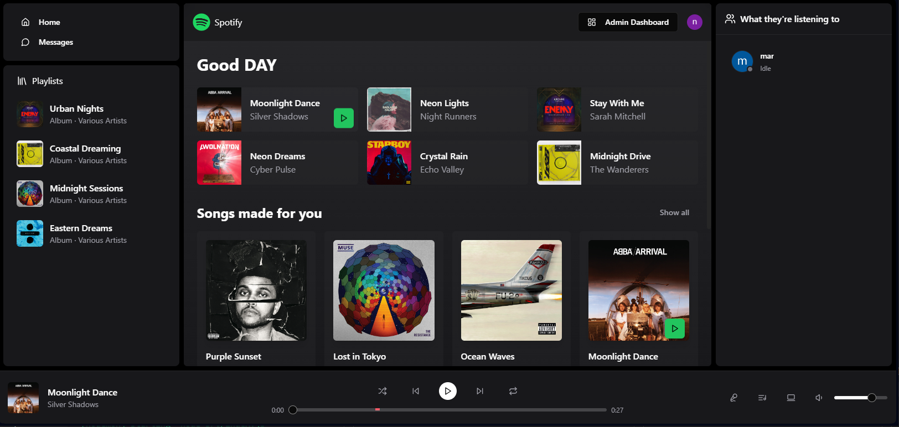
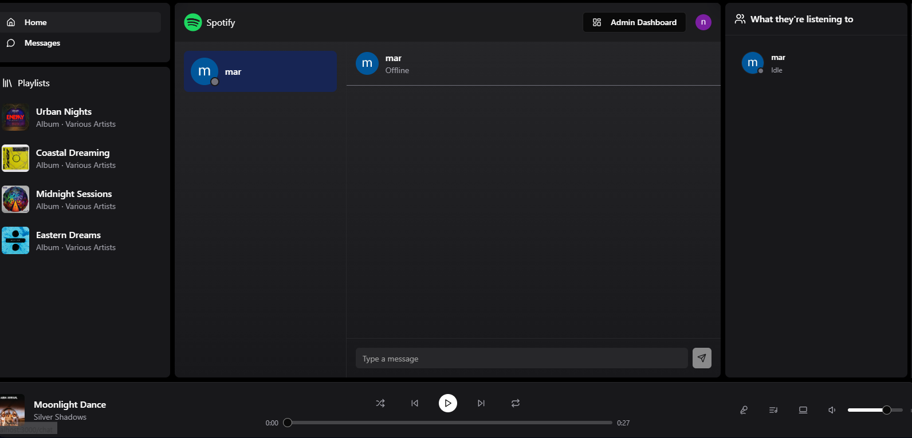

Spotify Clone

this project was a follow thru of the video => Advanced Spotify Clone: Build & Deploy a MERN Stack Spotify Application with React.js

- in the youtube channel "as a programmer"

Link => [Build a Linkedin Clone with React and Node.js | Full Stack Tutorial](https://youtu.be/4sbklcQ0EXc?si=iMLOp4xnUaF5nXN8)

go to the original repository for more information => https://github.com/burakorkmez/realtime-spotify-clone

thank you to Burak Orkmez and all involved in "As a programmer" for sharing! https://www.youtube.com/@asaprogrammer_

Screenshots

.env

PORT=
DATABASE_URI=

ADMIN_EMAIL=

CLOUDINARY_API_KEY=
CLOUDINARY_API_SECRET=
CLOUDINARY_CLOUD_NAME=
CLOUDINARY_URL=

NODE_ENV=development

CLERK_PUBLISHABLE_KEY=
CLERK_SECRET_KEY=

note: this project is saved- pre adaptations for deploying.
